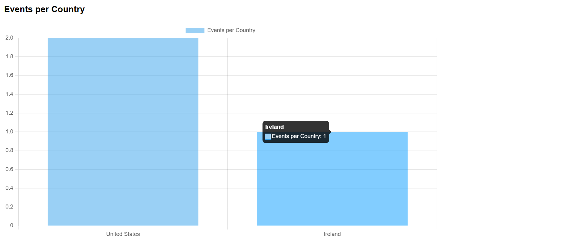
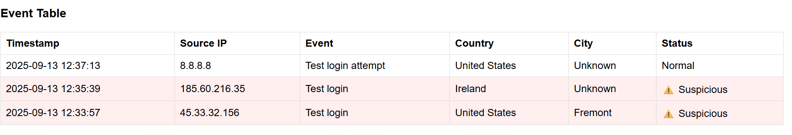
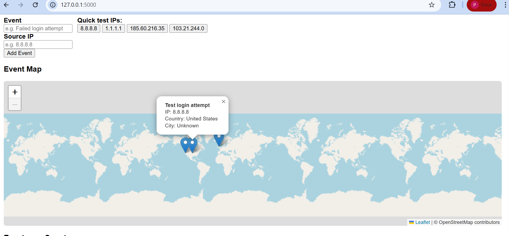

# siem-lite
Lightweight SIEM dashboard using Python and Flask

# 🛡️ SIEM Lite – Log Analysis & Threat Detection Dashboard

A lightweight **Security Information and Event Management (SIEM)** dashboard built with **Python (Flask)**   for centralized log analysis, threat detection, and visualization.  
This project demonstrates core cybersecurity concepts such as log monitoring, threat intelligence integration, and incident response workflows.

---

## 📌 Features
- ✅ Centralized **event logging & search**  
- ✅ **GeoIP lookup** to map source IPs to countries/cities  
- ✅ **Threat Intelligence correlation** to flag malicious IPs  
- ✅ Real-time **dashboard visualization**  
- ✅ Export suspicious events as **CSV**  
- ✅ Hands-on application of **CompTIA Security+ concepts**

---

## 🛠️ Tech Stack / Tools Used
- **Programming:** Python, Flask  
- **Security Tools:** Nmap, Wireshark, Metasploit (for testing)  
- **Libraries:** GeoIP2, Chart.js (frontend)  
- **Frontend:** HTML, CSS, JavaScript  
- **Other:** Git, VS Code

---

## 🚀 Installation & Setup

1. Clone the repository:
   ```bash
   git clone https://github.com/ppravallika324-cloud/siem-lite.git
   cd siem-lite

2. Create a virtual environment & activate it:
   
   py -3 -m venv venv
   venv\Scripts\activate     # On Windows

3. Install dependencies:
   pip install -r requirements.txt


4. Download the GeoLite2-City.mmdb file from MaxMind:
   Place the file in the project root (not included in repo if large).

5. Run the app:
   python app.py


6. Open your browser and go to:
   http://127.0.0.1:5000

📸 Screenshots

### Dashboard


### Event Table


### GeoIP Map


📚 Concepts Applied

    Threats & Vulnerabilities
    Security Architecture & Operations
    Incident Response
    Threat Intelligence
    Network Security Monitoring

🚀 Future Enhancements

   User authentication & role-based access
   Real-time log streaming (WebSockets)
   Alerting (email/Slack)
   Cloud deployment (Azure / AWS)


👩‍💻 Author

Pravallika P
GitHub: https://github.com/ppravallika324-cloud


